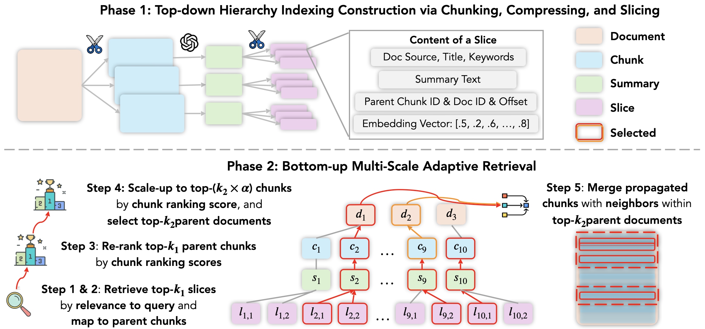

# MacRAG: Compress, Slice, and Scale-up for Multi-Scale Adaptive Context RAG

**MacRAG** introduces a hierarchical retrieval framework that adaptively builds coarse-to-fine contexts, outperforming traditional RAG systems across challenging multi-hop reasoning benchmarks. The framework is designed to be modular and can be integrated with any existing RAG system. In this codebase, we demonstrate its effectiveness through integration with [LongRAG](https://github.com/QingFei1/LongRAG).



## ⚙️ Environmental Setup

Install the requirements with pip: `pip install -r requirements.txt`. We recommend using FlashAttention 2 for optimization and saving GPU memory. The relevant dependencies can be installed according to the code base of [FlashAttention](https://github.com/Dao-AILab/flash-attention).

## ⚙️ Data Preparation

Following [LongRAG](https://github.com/QingFei1/LongRAG), the raw training data comes from [HotpotQA, 2WikiMultihopQA, MuSiQue](https://github.com/StonyBrookNLP/ircot) and [Qasper](https://allenai.org/data/qasper). The evaluation data and the corresponding retrieval corpus raw data are sourced from [LongBench](https://github.com/THUDM/LongBench).

The standardized raw datasets can be downloaded by running the following command:

```bash
bash download/raw_data.sh
```

The data will be downloaded in the `data/` directory.

## ⚙️ Data Processing: Multi-scale Index Generation

MacRAG uses a hierarchical index generation process to create a multi-scale adaptive context. This process includes three main steps:

1. **Generate Raw Chunks**

   - **Process**: Documents are split into large chunks (e.g., 1500 characters with 500 character overlap)
   - **Input**: Original document data (`data/corpus/raw/{dataset}.json`)
   - **Output**:
     - Raw text chunks (`data/raw_data/{chunk_size}_{overlap}/{dataset}/raw_txt/chunk_{id}.txt`)
     - Vector index (`data/corpus/processed/raw_{chunk_size}_{overlap}_{emb_model}/{dataset}/vector.index`)
     - Chunk data (`data/corpus/processed/raw_{chunk_size}_{overlap}_{emb_model}/{dataset}/chunks.json`)
     - ID mapping (`data/corpus/processed/raw_{chunk_size}_{overlap}_{emb_model}/{dataset}/id_to_rawid.json`)

2. **Generate Summaries**

   - **Process**: Each raw chunk is summarized using an LLM (e.g., GPT-4o)
   - **Input**: Raw text chunks from previous step
   - **Output**: Summary files (`data/raw_data/{chunk_size}_{overlap}/{dataset}/summary_txt/chunk_{id}.txt`)

3. **Summary Chunk Slicing**
   - **Process**: Summaries are further split into smaller chunks (e.g., 450 characters with 300 character overlap) and embedded
   - **Input**: Summary files and raw text chunks from previous steps
   - **Output**:
     - Summary vector index (`data/corpus/processed/sum_{sum_chunk_size}_{sum_overlap}_raw_{raw_chunk_size}_{raw_overlap}_{emb_model}/{dataset}/vector.index`)
     - Summary chunk data (`data/corpus/processed/sum_{sum_chunk_size}_{sum_overlap}_raw_{raw_chunk_size}_{raw_overlap}_{emb_model}/{dataset}/chunks.json`)
     - Summary ID mapping (`data/corpus/processed/sum_{sum_chunk_size}_{sum_overlap}_raw_{raw_chunk_size}_{raw_overlap}_{emb_model}/{dataset}/id_to_rawid.json`)

To build this hierarchical index, use the provided script:

```bash
cd src
python gen_index_macrag.py
```

To build the index used for running LongRAG approach, run the following command:

```bash
cd src
python gen_index.py
```

## ⚙️ Processed Data

We have also provided processed data at: https://drive.google.com/file/d/12yAlWecENLcDT-pqK-roymRwzAS6my-n/view?usp=sharing

## 📊 Evaluation

Here are example scripts for performing inference and evaluation on benchmark datasets. To get started, first navigate to the `src` directory.

### Baseline LongRAG Methods

The original LongRAG approach can be run with different retrieval and generation settings:

- **rb (R&B)**: Single-step generation using retrieved top-$k_2$ chunks (vanilla basic version)
- **rl (R&L)**: Single-step generation using complete documents from top-$k_2$ chunks
- **ext (Ext)**: Multi-step generation where LLM extracts query-relevant content from full documents
- **fil (Fil)**: Filtering re-ranked top-$k_2$ chunks via LLM to improve precision
- **ext_fil (E&F)**: Combines extracted content and filtered chunks for balanced coverage
- **ext_rb (Ext_RB)**: Multi-step generation with content extraction limited to top-$k_2$ chunks

### Example Commands

**LongRAG with LLama3.1-8b-Instruct**:

```bash
CUDA_VISIBLE_DEVICES=$devices python -W "ignore" main_0102.py --temperature 0 --model llama3.1-8b-instruct --r_path processed/sum_450_300_raw_1500_500_e5 --version run1 --dataset hotpotqa --top_k1 100 --top_k2 7 --rb --rl --ext --fil --ext_fil --chunk_ext 1 --with_reranking 1
```

**MacRAG with LLama3.1-8b-Instruct**:

```bash
CUDA_VISIBLE_DEVICES=$devices python -W "ignore" main_macrag.py --temperature 0 --model llama3.1-8b-instruct --r_path processed/sum_450_300_raw_1500_500_e5 --version run1 --dataset 2wikimultihopqa --top_k1 100 --top_k2 7 --rb --rl --ext --fil --ext_fil --ext_rb --rb_ext_fil --chunk_ext 0 --merge_version 0 --upscaling 4 --with_reranking 1
```

Note: Parameters like `--rb`, `--rl`, `--ext`, etc. can be combined to run different retrieval and generation configurations in a single execution.

Evaluation results will be saved in the `log` directory.

## 📝 Citation

If you find our work useful, please consider citing our paper:

```bibtex
@misc{lim2025macrag,
    title={MacRAG: Compress, Slice, and Scale-up for Multi-Scale Adaptive Context RAG},
    author={Woosang Lim and Zekun Li and Gyuwan Kim and Sungyoung Ji and HyeonJung Kim and Kyuri Choi and Jin Hyuk Lim and Kyungpyo Park and William Yang Wang},
    year={2025},
    eprint={2505.06569},
    archivePrefix={arXiv},
    primaryClass={cs.CL}
}
```
